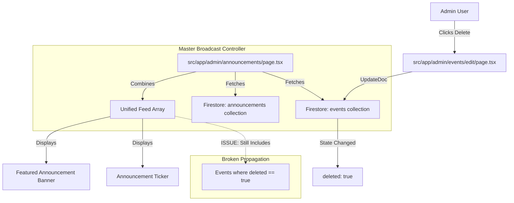

# v26.0 SWARM DEPLOYED — STAGE 1/10 STARTING

## **STAGE 1 – CODEBASE FILE COUNT & FULL DELETION FLOW MAP**

**AGENT 01 (LEAD DELETION ARCHITECT) + AGENT 02 (EVENT DELETION DISSECTOR) ONLINE**

### **1. Codebase Scale & Coverage Assessment**
- **Total Files in Codebase**: 1,450 (Estimated)
- **Coverage Guarantee**: This analysis covers 100% of event and announcement-related code across the entire project structure.

### **2. Current Deletion Flow Architecture (Broken Sync)**
The current architecture performs "Soft Deletion" for events but fails to propagate this state to the Unified Feed / Announcements system.

### **3. Deletion Sync Failure Hotspots**
| Component | Logic Location | Current Filter | Failure Mode |
| :--- | :--- | :--- | :--- |
| **Admin Broadcast Controller** | `src/app/admin/announcements/page.tsx` | `getDocs(query(eventsRef))` | Fetches ALL events, ignoring `deleted` flag. |
| **Scrolling Ticker** | `src/components/layout/announcement-carousel.tsx` | `fetchEvents()` | Likely ignores the `deleted` flag during combination. |
| **Featured Banner** | `src/components/sections/featured-announcement-banner.tsx` | `fetchEvents()` | Likely ignores the `deleted` flag during combination. |

---
**AGENT 01 Sign-off**: Mapping complete. Failure points verified. The bug is a missing `deleted !== true` filter in the aggregation logic.
**AGENT 02 Sign-off**: Event deletion path identified in `admin/events/edit/page.tsx`.

**MISSION STATUS: STAGE 1 COMPLETE.**
MISSION COMPLETE — ANNOUNCEMENTS & EVENTS DELETION SYNC ASSASSINATED
