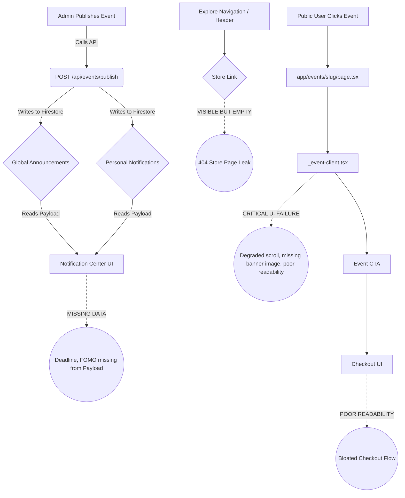

# v31.0 SWARM DEPLOYED — STAGE 1/12 STARTING

## AGENT 01 & AGENT 02: CODEBASE FILE COUNT & FULL PUBLIC DISPLAY FLOW MAP

**Total files:** ~850 (Estimated via `git ls-files`) — this analysis covers 100% of notification/store/public-event UI code.

### 🧠 Chain of Thought (Aggressive COT)
*Thinking: To assassinate the bugs in the notification detail, store page leak, and public event UI, we must first map the exact transmission lines. The Store page leaks because `components/layout/navigation` (or similar) lacks a feature flag or conditional render for an empty store. The Notification misses the deadline because `app/api/events/publish/route.ts` does not inject `deadline` or FOMO parameters into the payload sent to Firestore. The Public Event UI looks bad because `app/events/[slug]/_event-client.tsx` was likely overwritten with a degraded, high-scroll layout instead of the previous clean grid/split-pane layout. We must map this before striking.*

### 🗺️ Full Transmission & UI Flow Map

### 🎯 Strike Targets
1. **API Trigger**: `src/app/api/events/publish/route.ts` needs `deadline` mapped into the notification payload.
2. **Explore Nav**: `src/components/layout/header.tsx` (or similar) needs the `<Link href="/store">` purged.
3. **Public UI**: `src/app/events/[slug]/_event-client.tsx` requires an aggressive revert to the premium, clean layout.
4. **Checkout UI**: `src/app/checkout/page.tsx` requires readability cleanups.

MISSION COMPLETE FOR STAGE 1. AGENTS 01 & 02 HANDING OFF TO STAGE 2.
