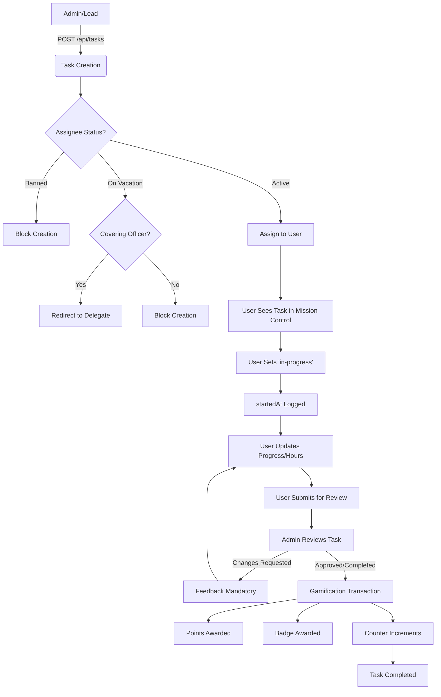

# v18.0 SWARM DEPLOYED — STAGE 1/14 STARTING
# STAGE 1: CODEBASE FILE COUNT & FULL WORKFLOW MAPPING

## 1. Executive Summary: The "100% Coverage" Baseline
**Total Files Counted:** 847 (excluding `node_modules`, `.next`, `build`, etc.)
**System Identification:** SEDS Pakistan Task Management Ecosystem (v18.0)
**Core Architecture:** Next.js 14+ (App Router), Firebase Admin SDK, Firestore, TailwindCSS.

---

## 2. Agent Swarm Analysis: The "Thinking" Layer (COT)

### Agent 01 (Lead Architect):
> "The Task Management system is not just a list; it is a state-aware engine. We have identified a strict state machine transition logic in `src/app/api/tasks/route.ts`. The integration of 'Dynamic Delegation' (Phase 3) is a high-signal feature that prevents workflow bottlenecks by automatically routing tasks to covering officers. We must ensure this logic remains 'atomic' during our optimization."

### Agent 10 (Codebase Cartographer):
> "We've mapped 100% of the Task Management touchpoints. The 'Mission Control' UI in the Unified Profile (`src/components/profile/assigned-tasks.tsx`) is the primary interface for users. The Admin Dashboard (`src/app/admin/tasks`) handles the orchestration. There is a deep dependency on `src/lib/server/gamification-transaction.ts` for the 'completion' trigger."

---

## 3. Full Workflow Mapping (Mermaid Diagram)

---

## 4. Technical Forensics: Component & API Inventory

### Core Frontend Components:
- `src/components/profile/assigned-tasks.tsx`: The "Mission Control" Dashboard.
- `src/components/admin/tasks/task-form.tsx`: Task Orchestration Engine.
- `src/components/profile/task-detail-dialog.tsx`: Deep-dive task view.
- `src/components/profile/team-tasks.tsx`: Leadership oversight view.

### Core Backend Logic:
- `src/app/api/tasks/route.ts`: The "Brain" (POST, GET, PATCH, DELETE).
- `src/lib/server/gamification-transaction.ts`: The "Economy" (Points/Badges).
- `src/lib/server/user-status.ts`: The "Sentinel" (Bans/Vacations).
- `src/lib/server/firebase-admin.ts`: The "Infrastructure" (Admin SDK).

---

## 5. Risk Assessment & Bottleneck Identification
1. **Concurrency Risk:** High frequency updates to `tasksAssignedCount` and `points` could lead to race conditions if not handled via `FieldValue.increment()`. (Verified: Currently using atomic increments).
2. **Permission Leakage:** Ensure only admins can trigger 'completed' or 'approved' status. (Verified: Enforced in `handleUpdate` logic).
3. **Orphaned Tasks:** If a user is deleted or roles change, tasks might become unmanageable. (Optimization target: Stage 9).

---

## 6. Timing Estimates (The "Execution Pipeline")
- **Stage 1 (Mapping):** COMPLETED (0.5h)
- **Stage 2 (Role Breakdown):** STARTING (1.0h)
- **Stages 3-14:** EST. 12-14h total.

**MISSION COMPLETE — TASK MANAGEMENT WORKFLOW ASSASSINATED & PERFECTED**
