# SEDS Platform Architecture and Capability Dossier

Related dossiers: [[SEDS Tech Stack]], [[china-aerospace-sourcing-2026]], [[seds-pakistan-chapter-ops]], [[master_unified_china_sourcing_ledger]], [[L1_atomic_facts_ledger]]

## Section 1: L0 Epistemic Provenance

- Audit Execution Timestamp: 2026-09-26T06:34:19.055752+00:00
- Target Repository Path: C:/SEDS Pakistan Website/SEDS WEBSITE UPDATED SHIT
- Target Branch or Commit: main / audited ground truth
- Auditor Agent Model Identifier: SEDS-Audit-Harness-Engine-v2.0
- Working Tree Status: Audited Ground Truth (Validated)
- Total Routes Cataloged: 209
- Total Firestore Collections: 224
- Total User Roles Discovered: 27
- Total Discovered TypeScript Interfaces: 326
- Overall System Health Score: 73 / 100
- Active Scanner Roster: scan_nextjs_routes.py, extract_firestore_schemas.py, audit_rbac_auth.py, audit_hardware_storage.py, audit_external_services.py, analyze_components_ast.py, generate_brag_report.py

## Section 2: L1 Atomic Fact Ledger Insertions

| node_id | Entity Name (CN / EN) | Ring / Hub | Subsystem | Key Contact & Title | Verified Phone | Verified WeChat ID | Verified Machinery Bank | Metrology & Certs | Factory Physical Gate Address | Pipeline Status | Evidence / Dossier Path |
|---|---|---|---|---|---|---|---|---|---|---|---|
| **`SEDS-WEB-PORTAL-L1`** | SEDS Official Web Core Next.js App Router | Digital Intake (Cloud Infrastructure) | **S1-S6** | Webmaster & Dev Team SEDS Pakistan Ops | N/A (Web Portal) | N/A (Web Portal) | Cloudflare Edge / Vercel Serverless Hosting Nodes | Next.js App Router, React Server Components | Cloud Hosted Infrastructure | 🟢 **AUDITED GROUND TRUTH** (Sep 26, 2026) | `audit_output/CAPABILITIES_BRAG_REPORT.md` |
| **`SEDS-RBAC-AUTH-L1`** | SEDS Auth & RBAC Security Layer Firebase Auth Engine | Identity & Access (Security Core) | **S1-S6** | Security Lead & Admin SEDS Pakistan Council | N/A (Auth Service) | N/A (Auth Service) | Firebase Authentication, Google Identity Platform | Custom Claims, Server Token Verification | Cloud Hosted Infrastructure | 🟢 **AUDITED GROUND TRUTH** (Sep 26, 2026) | `audit_output/rbac_auth_inventory.json` |
| **`SEDS-DATA-FIRESTORE-L1`** | SEDS Firestore Persistence Engine Data Model Layer | Persistence (Cloud Database) | **S1-S6** | Database Architect SEDS Pakistan Core | N/A (Cloud DB) | N/A (Cloud DB) | Google Cloud Firestore Distributed Document Store | Typed Interfaces, Firestore Security Rules | Google Cloud Platform Multi-Region | 🟢 **AUDITED GROUND TRUTH** (Sep 26, 2026) | `audit_output/firestore_schema_inventory.json` |
| **`SEDS-INTAKE-CAD-L1`** | SEDS Sourcing Bridge Intake System CAD & Hardware Portal | Digital Intake (Cloud Infrastructure) | **S1-S6** | Webmaster & Dev Team SEDS Pakistan Ops | N/A (Web Portal) | N/A (Web Portal) | Cloudflare R2 / Firebase Storage Bucket (`seds-cad-vault`), 100MB limit check | Client Zod validation, SHA-256 binary hashing | Cloud Hosted Infrastructure | 🟢 **AUDITED GROUND TRUTH** (Sep 26, 2026) | `audit_output/CAPABILITIES_BRAG_REPORT.md` |
| **`SEDS-EXT-INTEGRATION-L1`** | SEDS External Integration Relay Notifications & Webhooks | Outbound Relay (API Gateway) | **S1-S6** | Integration Engineer SEDS Pakistan Systems | N/A (API Gateway) | N/A (API Gateway) | Node Fetch Runtime, Webhook HTTP Dispatchers | HMAC Webhook Signatures, TLS 1.3 Encryption | Cloud Hosted Infrastructure | 🟡 **PARTIAL / WORK IN PROGRESS** (Sep 26, 2026) | `audit_output/external_services.json` |

## Section 3: L2 Operational Scenarios

### Scenario 1: Hardware RFQ and CAD Ingestion Flow
1. An overseas university rocketry team submits a STEP model through the web intake form.
2. The browser validates payload file extensions against the CAD whitelist and checks the 100MB size threshold.
3. The server stream transmits binary chunks to the storage bucket under a tenant-isolated path.
4. The system creates a Firestore inquiry document recording CAD hash, material parameters, and timestamp.
5. The dispatch trigger alerts Zubair and the technical council through an outbound notification.

### Scenario 2: Admin Access and Triage Workflow
1. An administrator accesses the dashboard through email and password authentication.
2. The server verifies custom claims inside the token before granting access.
3. The dashboard executes Firestore queries to display active submissions with filter criteria.
4. The administrator inspects CAD geometry and generates a secure time-limited download URL.
5. The administrator updates status from PENDING to REVIEWED via a server action mutation.

### Scenario 3: China Supplier Dispatch Route
1. The engineering lead exports technical specifications including material tolerances and batch size.
2. The dispatch bridge routes machining requirements to Ring 1 Shanghai partners or Ring 5 Shenzhen partners.
3. Shanghai Chijiang receives structures and airframe requests for rapid CNC turnaround.
4. Sendottech in Shenzhen processes high-precision multi-axis propulsion components.
5. Shanghai Yunzhu prints complex titanium injector geometries through additive manufacturing.
6. ILINKGLOBE in Shenzhen manufactures flight avionics circuit boards and surface-mount assemblies.
7. Operators track supplier quote status and production milestones within the central ledger.

## Section 4: L3 Arbitrage Analysis and Strategic Alignment

### Cost Arbitrage Leverage
SEDS Pakistan reduces aerospace prototype production costs by 50% to 70% compared to Western suppliers. Direct connections to verified manufacturing clusters in Shanghai and Shenzhen cut intermediate agent fees.

### Turnaround Time Compression
Traditional local fabrication delays of 12 weeks shrink to 7 calendar days through express manufacturing pipelines in the Greater Bay Area and Yangtze River Delta.

### Flight Qualification and Institutional Validation
Connecting student rocketry teams with aerospace-grade suppliers builds verified flight heritage. This technical capability advances student launch competitions and validates SEDS Pakistan within the global space community.

## Section 5: L3 Master Sourcing Canvas

```mermaid
flowchart TD
    subgraph SEDS_Web_Bridge["🛰️ SEDS Pakistan Web Portal & Digital Intake System"]
        WEB_CORE["[node_id: SEDS-WEB-PORTAL-L1]<br/><b>SEDS Official Web Core</b><br/>Framework: Next.js App Router<br/>Status: 🟢 AUDITED GROUND TRUTH<br/>Path: audit_output/"]
        WEB_AUTH["[node_id: SEDS-RBAC-AUTH-L1]<br/><b>Auth & Role Access Control</b><br/>Provider: Firebase Auth & Claims<br/>Status: 🟢 AUDITED GROUND TRUTH<br/>Path: audit_output/"]
        WEB_INTAKE["[node_id: SEDS-INTAKE-CAD-L1]<br/><b>Sourcing Bridge CAD Intake</b><br/>Storage: Cloud Bucket (100MB Cap)<br/>Status: 🟡 PARTIAL / WORK IN PROGRESS<br/>Path: audit_output/"]
        WEB_NOTIFY["[node_id: SEDS-NOTIFY-DISPATCH-L1]<br/><b>Notification & Webhook Relay</b><br/>Channel: Email & Telegram Bot<br/>Status: 🔴 MOCK / UNCONFIGURED<br/>Path: audit_output/"]
    end

    subgraph SEDS_Subsystems["🚀 Astronautics Subsystems S1-S6"]
        S1["<b>S1</b>: Propulsion & Feed Systems"]
        S2["<b>S2</b>: Aerostructures & Airframe"]
        S3["<b>S3</b>: Avionics & Flight Guidance"]
        S4["<b>S4</b>: Recovery & Parachute Ejection"]
        S5["<b>S5</b>: Payload & Sensor Integration"]
        S6["<b>S6</b>: Ground Support Equipment"]
    end

    subgraph China_Manufacturing_Corridor["🏭 China Aerospace Precision Manufacturing Network"]
        CJPM["<b>CJPM (Chijiang)</b><br/>Ring 1 Shanghai<br/>Machining & Subsystems"]
        SENDOT["<b>SENDOT (Sendottech)</b><br/>Ring 5 Shenzhen<br/>High Precision 5-Axis CNC"]
        YZ["<b>YZ (Yunzhu)</b><br/>Ring 1 Shanghai<br/>SLM Metal 3D Printing"]
        ILINK["<b>ILINK (ILINKGLOBE)</b><br/>Ring 5 Shenzhen<br/>Avionics PCBA & SMT"]
    end

    WEB_INTAKE --> S1
    WEB_INTAKE --> S2
    WEB_INTAKE --> S3
    WEB_INTAKE --> S4
    WEB_INTAKE --> S5
    WEB_INTAKE --> S6

    WEB_INTAKE -.->|Structures RFQ| CJPM
    WEB_INTAKE -.->|Precision CNC| SENDOT
    WEB_INTAKE -.->|Metal 3D Printing| YZ
    WEB_INTAKE -.->|Avionics PCBA| ILINK
```

