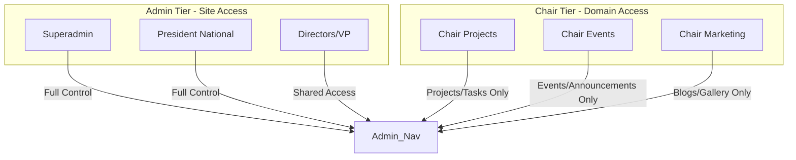

# STAGE 2 — ROLE BREAKDOWN: CHAIRS & SPECIALIST TEAMS
## v11.0 SWARM DEPLOYED — STAGE 2/15 (ROLE 5 of 5)
**AGENT 02 – ROLE DISSECTOR**

---

> **Thinking (COT):** Chair roles (level 8) and Team roles (level 7) are domain-specific. While they have high hierarchy level numerically, their site permissions are surgical. This MD details exactly which chair can do what, preventing permission creep.

---

## 🏗️ Chair Roles (Hierarchy Level 8)

Chairs lead specific committees. Their access is restricted to their domain to ensure organizational stability.

### 🛡️ Roles with Admin Navigation Access

| Role Key | Domain | Key Powers |
|---|---|---|
| `chair_projects` | Projects Committee | `manageProjects`, `manageTasks`, `manageBlogs` |
| `chair_events` | Events Committee | `manageEvents`, `manageAnnouncements`, `listEventRegistrations` |
| `chair_marketing` | Marketing & Comms | `manageOwnBlogs`, `manageGallery`, `canManageGallery` |

---

### 👥 Committee Specialist Roles (Member-Tier Access)

The following chairs are hierarchy level 8 but do NOT have site-wide admin navigation. They operate as privileged members in their respective areas:

- `chair_outreach` (Outreach Committee)
- `chair_design` (Design / Media)
- `chair_alumni` (Alumni / Legacy Network)
- `chair_recruitment` (Recruitment / Membership)
- `chair_ethics` (Ethics / Sustainability)
- `chair_sponsorship` (Sponsorship / Finance)

**Note:** If these roles need to publish content, they must be assigned temporary `manageBlogs` or `manageEvents` permissions by the President, or work through their respective Director (level 9).

---

## 🚀 Technical Specialist Teams (Level 7)

Specialist teams represent the core technical output of SEDS Pakistan. Members in these roles have standard member access but are tagged for project assignments and leaderboard competition.

| Team | Role Key | Focus |
|---|---|---|
| 🌌 **Rocketry** | `rocketry_team` | High-power rocketry, engine design, flight dynamics |
| 🛰️ **CubeSat** | `cubesat_team` | Small satellite electronics, payload, communications |
| 🚜 **Rover** | `rover_team` | Robotics, autonomous navigation, mechanical systems |

---

## 📊 Comparison: Admin Tier vs Chair Tier

---

*AGENT 02 sign-off: Chairs and Specialist teams documented. Roles stage complete with 5 MDs.*
