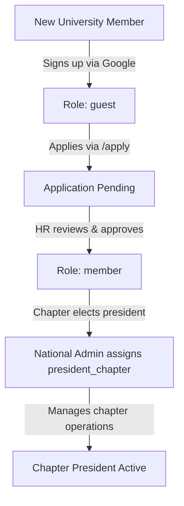

# STAGE 2 — ROLE BREAKDOWN: CHAPTER LEAD ROLES
## v11.0 SWARM DEPLOYED — STAGE 2/15 (ROLE 3 of 5)
**AGENT 02 – ROLE DISSECTOR**

---

> **Thinking (COT):** `president_chapter` is the chapter-level president (level 1!!! — note: hierarchy level 1, not 10). This is intentionally set to 1, meaning chapter presidents don't have elevated national admin access. They manage their own chapter but don't override national leadership. All leadership within a chapter flows through the chapter president's coordination.

---

## 🏫 Role: Chapter President (`president_chapter`)

**Hierarchy Level:** 1 ← This is NOT a typo. Chapter presidents are at level 1 in the national hierarchy.  
**Display Name:** "President"  
**Scope:** Chapter-level authority only. This role governs one specific SEDS chapter.

> **Design Decision:** Chapter presidents have the same numeric hierarchy level as `member` (level 1). This ensures national leadership (`president_national`, `vice_president`, etc.) retains authority over all chapters. Chapter presidents manage their chapter via chapter-specific tools, not national admin tools.

### What a Chapter President Can Do
| Feature | Access |
|---|---|
| Access admin panel | ❌ (hasSiteAdminAccess = false) |
| View/manage own chapter events | ✅ (via chapter-specific filters) |
| View/manage own chapter members | ✅ |
| Register for events | ✅ |
| Submit chapter applications via `/register-chapter` | ✅ |
| Edit own profile | ✅ |
| View leaderboard | ✅ |
| Tasks assigned to them | ✅ |

### Chapter President Workflow
1. Chapter president registers their chapter at `/register-chapter`
2. National admin approves the chapter registration
3. Chapter president can then manage chapter-specific operations
4. For any national-level content, they must coordinate with VP or President

---

## 🏢 Chapter System Overview

### What is a Chapter?
Each Pakistani university has a SEDS chapter. Chapters are tracked in Firestore under the `chapters` collection. Admin management at `/admin/chapters`.

### Chapter Data Structure
```
chapters/{chapterId}
  name: string
  university: string
  city: string
  presidentUid: string
  memberCount: number
  isActive: boolean
  createdAt: Timestamp
```

### User ↔ Chapter Relationship
- Every `UserProfile` has an optional `chapterId` field
- This links each member to their university chapter
- The `chapterLead` for a chapter can see their chapter's members

---

## 📋 Role Comparison: Chapter President vs National President

| Feature | `president_chapter` (level 1) | `president_national` (level 10) |
|---|---|---|
| Admin panel access | ❌ | ✅ |
| Assign roles | ❌ | ✅ |
| Delete users | ❌ | ✅ |
| Manage national events | ❌ | ✅ |
| View audit logs | ❌ | ✅ |
| Manage own chapter | ✅ (indirect) | ✅ (via national admin) |
| Store management | ❌ | ❌ (superadmin only) |

---

## 🔄 Role Assignment Flow for Chapters



---

## 📝 Quick Reference: All 24 Roles

| # | Role Key | Display Name | Level | Admin Access |
|---|---|---|---|---|
| 1 | `superadmin` | Super Admin | 11 | ✅ Full |
| 2 | `president_national` | Pakistan President | 10 | ✅ Full (no store) |
| 3 | `vice_president` | Vice President | 9 | ✅ Leadership |
| 4 | `general_secretary` | General Secretary | 9 | ✅ Leadership |
| 5 | `projects_director` | Projects Director | 9 | ✅ Leadership |
| 6 | `marketing_head` | Marketing/Outreach Head | 9 | ✅ Leadership |
| 7 | `hr_director` | HR or Membership Director | 9 | ✅ Leadership |
| 8 | `treasurer` | Treasurer | 9 | ✅ Leadership |
| 9 | `advisor` | Advisor / Faculty Head | 8 | ✅ Advisor |
| 10 | `chair_projects` | Chair Projects Committee | 8 | 🔶 Limited |
| 11 | `chair_marketing` | Chair Marketing & Comms | 8 | 🔶 Own blogs/gallery only |
| 12 | `chair_outreach` | Chair Outreach Committee | 8 | ❌ Member-level |
| 13 | `chair_design` | Chair Design / Media | 8 | ❌ Member-level |
| 14 | `chair_alumni` | Chair Alumni / Legacy | 8 | ❌ Member-level |
| 15 | `chair_events` | Chair Events Committee | 8 | 🔶 Events/announcements |
| 16 | `chair_recruitment` | Chair Recruitment | 8 | ❌ Member-level |
| 17 | `chair_ethics` | Chair Ethics | 8 | ❌ Member-level |
| 18 | `chair_sponsorship` | Chair Sponsorship | 8 | ❌ Member-level |
| 19 | `rocketry_team` | Rocketry Team | 7 | ❌ Member-level |
| 20 | `cubesat_team` | CubeSat/CanSat Team | 7 | ❌ Member-level |
| 21 | `rover_team` | Rover Team | 7 | ❌ Member-level |
| 22 | `president_chapter` | President (Chapter) | 1 | ❌ Member-level |
| 23 | `member` | Member | 1 | ❌ |
| 24 | `guest` | Guest | 0 | ❌ |

---

*AGENT 02 sign-off: Chapter lead role and complete role index delivered. Stage 2 complete.*
