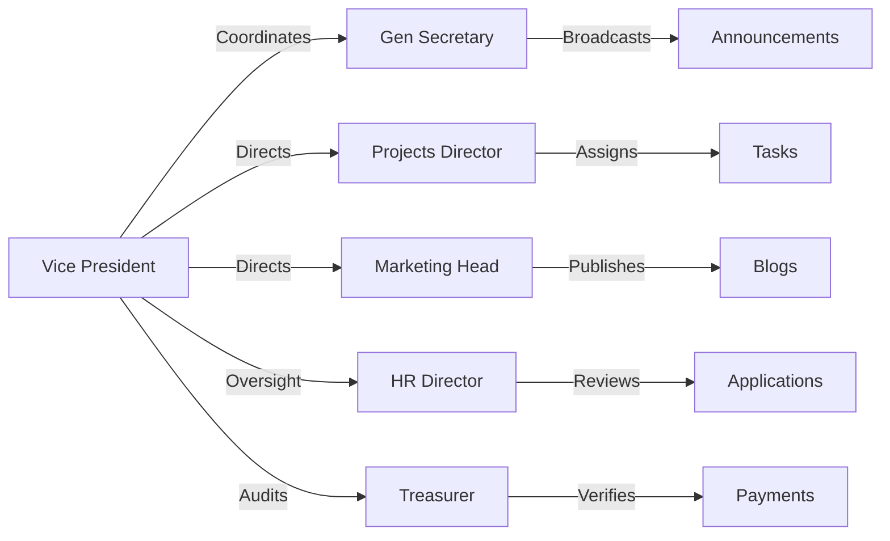

# STAGE 2 — ROLE BREAKDOWN: EXECUTIVE LEADERSHIP (VP, GENSEC, DIRECTORS)
## v11.0 SWARM DEPLOYED — STAGE 2/15 (ROLE 4 of 5)
**AGENT 02 – ROLE DISSECTOR**

---

> **Thinking (COT):** The leadership tier (VP, General Secretary, Projects Director, Marketing Head, HR Director, Treasurer) is hierarchy level 9. They have `hasSiteAdminAccess = true` and shared `manageEvents`, `manageBlogs`, `manageAnnouncements` permissions. This MD details their specific administrative focuses and cross-role interaction flows.

---

## 🎖️ Executive Leadership Roles (Hierarchy Level 9)

These roles are the backbone of SEDS Pakistan operations. They have the power to create and manage all content but cannot assign roles (President/Superadmin only).

---

### 1. Vice President (`vice_president`)
**Purpose:** National secondary lead; coordinates all directors and chairs.

- **Primary Focus:** Strategic alignment, oversight of all committees.
- **Admin Section Focus:** Dashboard metrics, audit logs, high-level project review.
- **Permissions:** `manageEvents`, `manageBlogs`, `manageAnnouncements`, `manageProjects`, `listEventRegistrations`, `viewAuditLogs`.

---

### 2. General Secretary (`general_secretary`)
**Purpose:** Administrative hub; ensures documentation, legal compliance, and meeting coordination.

- **Primary Focus:** Official communications, meeting minutes, chapter compliance.
- **Admin Section Focus:** Announcements, legal documents, chapter records, Universal Inbox.
- **Permissions:** `manageAnnouncements`, `manageChapters`, `manageOrganizations`, `manageRoleDefinitions`, `listApplications`.

---

### 3. Projects Director (`projects_director`)
**Purpose:** Technical lead; manages all technical projects and task delegations.

- **Primary Focus:** Rocketry, CubeSat, Rover project delivery and task accountability.
- **Admin Section Focus:** `/admin/projects`, `/admin/tasks`, `/admin/submissions` (Tasks tab).
- **Permissions:** `manageProjects`, `manageTasks`, `manageOwnBlogs`, `adjustUserPoints` (for project work).

---

### 4. Marketing/Outreach Head (`marketing_head`)
**Purpose:** Branding and external growth lead; manages social presence and public image.

- **Primary Focus:** Blog content, gallery, CRM (sponsors/partners), and public announcements.
- **Admin Section Focus:** `/admin/blog`, `/admin/gallery`, `/admin/announcements`, `/admin/crm`.
- **Permissions:** `manageBlogs`, `manageGallery`, `manageAnnouncements`, `manageOrganizations` (partners).

---

### 5. HR or Membership Director (`hr_director`)
**Purpose:** People management lead; oversees recruitment, induction, and member welfare.

- **Primary Focus:** Member lifecycle from applicant to alumni.
- **Admin Section Focus:** `/admin/submissions` (Applications tab), `/admin/users`, `/admin/roles`.
- **Permissions:** `manageApplications`, `listApplications`, `adjustUserBadges`, `listEventRegistrations`.

---

### 6. Treasurer (`treasurer`)
**Purpose:** Financial oversight; ensures all funds are tracked and verified.

- **Primary Focus:** Order verification, financial reporting, store-linked event tracking.
- **Admin Section Focus:** `/admin/orders`, `/admin/store` (read-only), `/admin/submissions` (Orders tab).
- **Permissions:** `listEventRegistrations`, `viewAuditLogs`, `manageChapters` (financial compliance).

---

## 🔄 Interaction Flow: "The Leadership Sync"

---

*AGENT 02 sign-off: All 6 executive leadership roles fully dissected with specific operational focus areas.*
