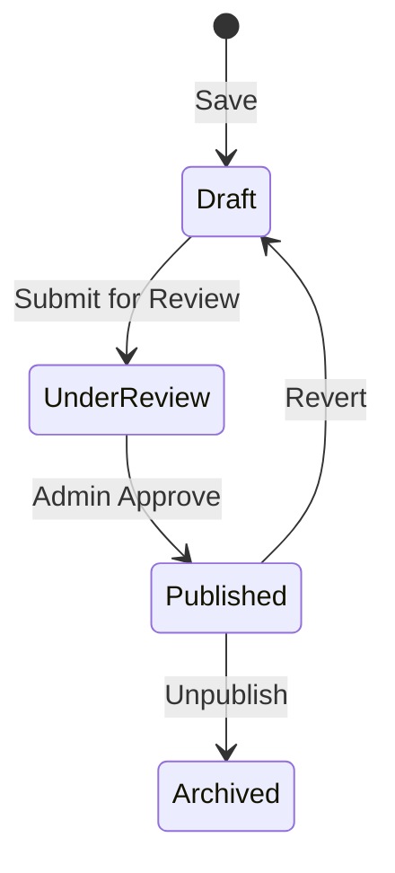

# STAGE 3 — PAGE BREAKDOWN: BLOG & CMS
## v11.0 SWARM DEPLOYED — STAGE 3/15 (PAGE 8 of 11)
**AGENT 03 – PAGE BUTCHER**

---

> **Thinking (COT):** The Blog is the knowledge hub of SEDS Pakistan. It uses a markdown-heavy CMS. This MD details the blog listing, detail view, and admin editor.

---

## 📰 Page: Blog (`/blog`)

**Files:** `src/app/blog/page.tsx`, `src/app/blog/[slug]/page.tsx`  
**Visibility:** Public.  
**Purpose:** Disseminating technical knowledge, project updates, and opinions.

---

## Content Consumption (User-Facing)

### 1. Blog Listing (`/blog`)
- **Visuals:** Masonry or Grid layout of article cards.
- **Filtering:** Filter by Category (Technology, Space, Events) and Tags.
- **Search:** Title and author search.
- **Pagination:** Results are paginated to ensure fast load times.

### 2. Article Detail View (`/blog/[slug]`)
- **Markdown Rendering:** Supports code blocks, tables, images, and links.
- **Metadata:** Shows author name, publication date, reading time estimation.
- **SEO:** Each post has unique meta-tags and JSON-LD structured data for Google.

---

## 🖋️ Admin Blog Management (`/admin/blogs`)

**Access:** `manageBlogs` permission roles.  
**Purpose:** Integrated CMS for creating and publishing content.

### The Editor Central (`/admin/blogs/new`)
- **Rich Text / Markdown Toggle:** Choice of raw markdown or a visual editor.
- **Cover Image:** Drag-and-drop upload to Firebase Storage.
- **Drafting System:** Save as 'Draft' → Request Review → Publish (status flow).
- **Author Assignment:** Admin can ghost-write on behalf of any other user UID.

---

## 📊 Content Status Lifecycle

---

## 🏁 Performance & SSR
- Blog posts use **Next.js Dynamic Routes** with ISR (Incremental Static Regeneration).
- Updates in the admin panel refresh the public post within seconds using `revalidatePath`.

---

*AGENT 03 sign-off: Blog and CMS page fully documented.*
