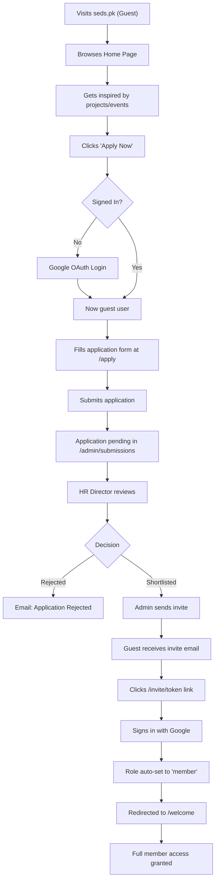
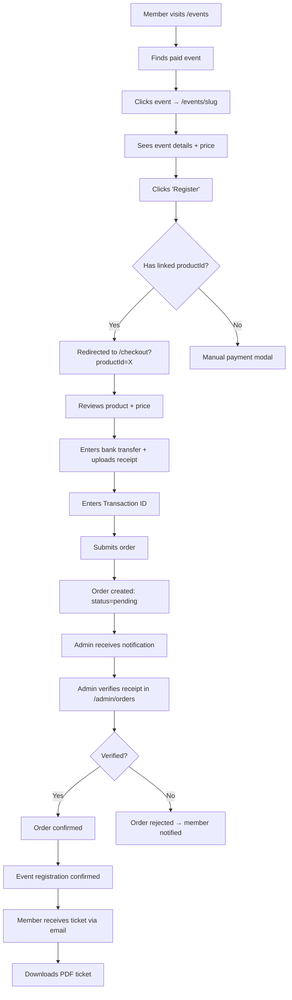
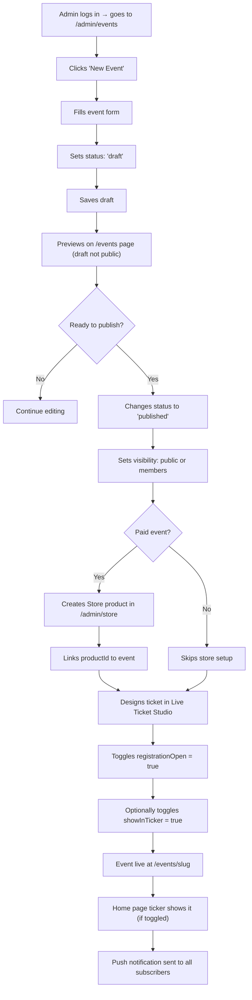
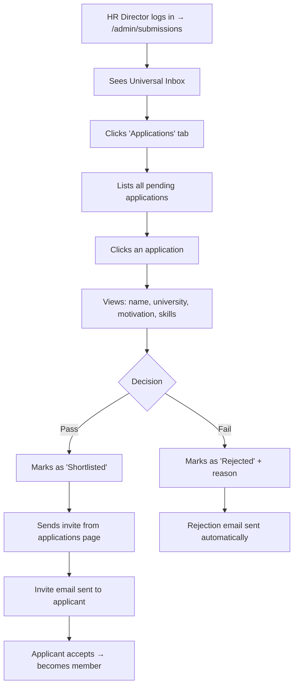
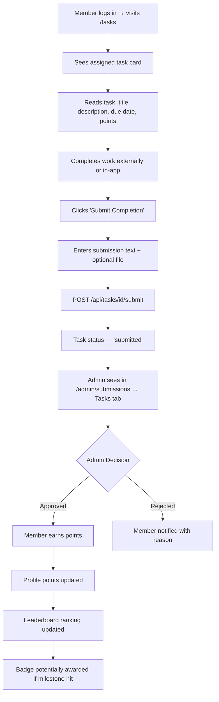
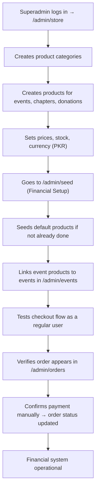
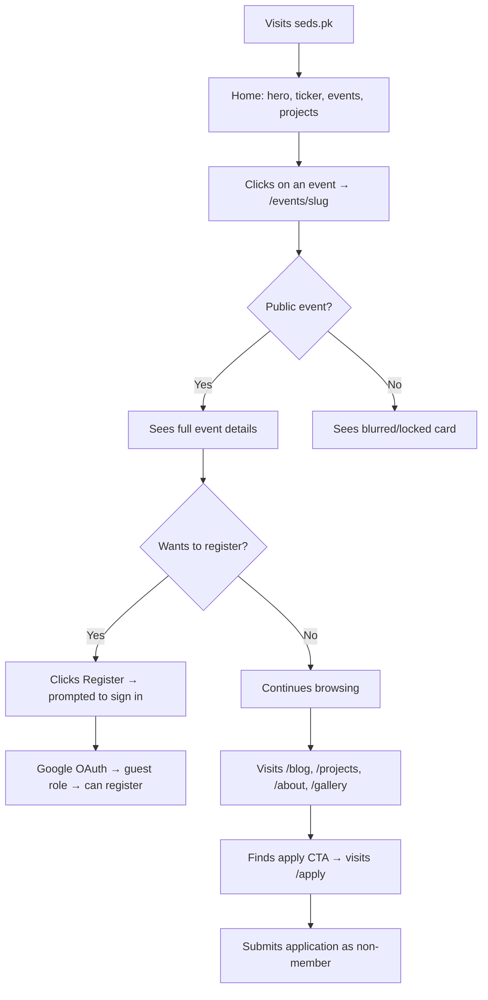

# STAGE 6 — USER JOURNEY FLOWS
## v11.0 SWARM DEPLOYED — STAGE 6/15
**AGENT 07 – USER JOURNEY MAPPER**

---

> **Thinking (COT):** Real-life users don't read docs — they navigate by intent. These journeys map the most common real-world paths through the site for each role, so any user can operate without a walkthrough.

---

## 🗺️ Journey 1: New Guest → Becomes a Member

---

## 🗺️ Journey 2: Member Registers for a Paid Event

---

## 🗺️ Journey 3: Admin Creates & Publishes an Event

---

## 🗺️ Journey 4: Admin Manages Induction Applications

---

## 🗺️ Journey 5: Member Completes a Task & Earns Points

---

## 🗺️ Journey 6: Superadmin Sets Up Financial System

---

## 🗺️ Journey 7: Guest Browses Public Content (No Sign-In)

---

*AGENT 07 sign-off: 7 complete user journey flows with mermaid diagrams for all major roles and scenarios.*
