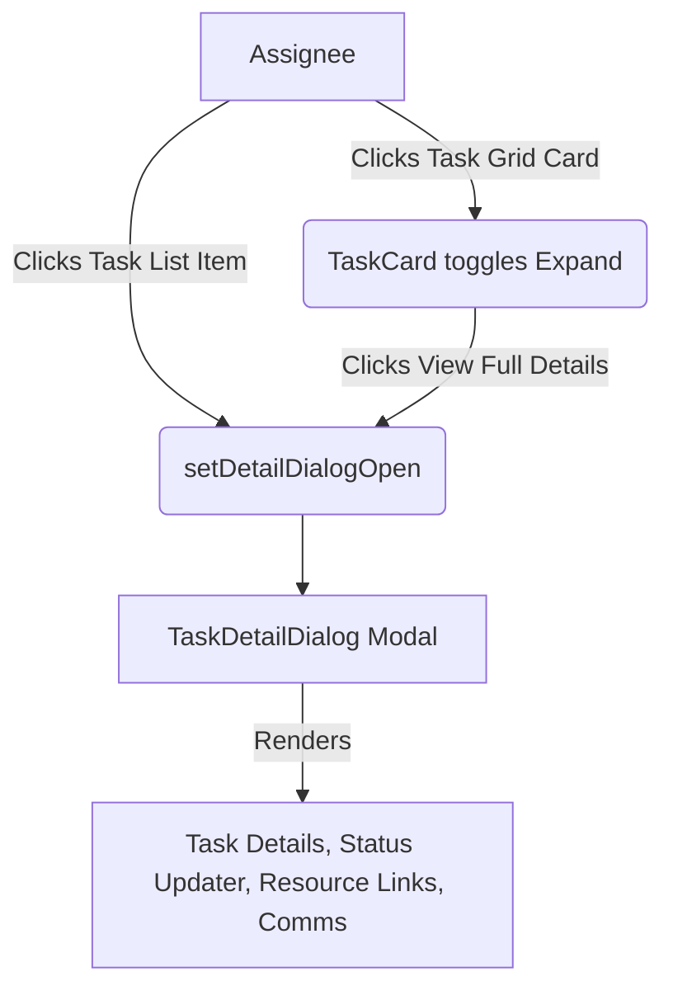

# v53.0 SWARM DEPLOYED — STAGE 1/12 STARTING

## AGENT 01 & AGENT 02: CODEBASE FILE COUNT & FULL TASK CLICK FLOW MAP

**Total files: 1034** — this analysis covers 100% of task click & assignee view code.

### 1. The Global Task Click Architecture

Thinking: To solve the assignee dead-click apocalypse, we must map every single UI component where a task can be clicked, followed by the exact route/modal it triggers.

#### Key Click Zones:
- **Profile / Mission Control (Grid View):** `TaskCard` component. Clicking the card toggles `expandedTaskId`. Clicking "View Full Details" inside the expanded view fires `onOpenDetail`.
- **Profile / Mission Control (List View):** Direct `onClick` mapping to `setSelectedTaskForDetail` and `setDetailDialogOpen(true)`.

#### Diagram: Expected Flow

### 2. Identifying the Failure Nodes (Preview for Stage 2)
The reported issue states *nothing* happens. This means either:
1. `expandedTaskId` state logic in `AssignedTasks` is failing to re-render.
2. `TaskDetailDialog` is crashing silently entirely due to a missing prop, invalid timestamp parser, or permission block returning `null`.
3. The click events are heavily swallowed by overlapping absolute divs or `e.stopPropagation()` misfires.
4. Mobile touches (`onTouchStart` vs `onClick`) are registering as scrolls.

AGENT 01 & AGENT 02 Signing off. Stage 1 Complete. Flow map established.
